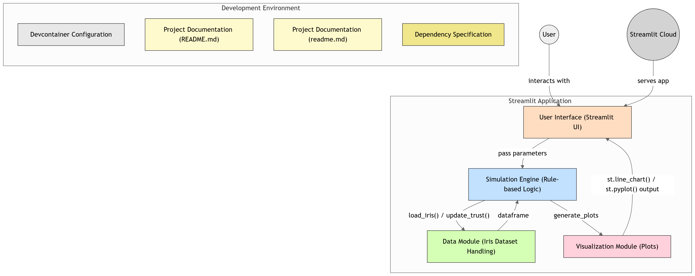

# Adaptive AI Trust Simulator  

This is a simple Streamlit application simulating how user trust in an AI visualization assistant calibrates over a fixed number of interaction turns.

The code simulates AI behavior using simple rule-based logic and probabilities for suggestions and adaptive error rates, rather than applying complex AI algorithms.

It demonstrates concepts such as:
- Shows how trust in AI adjusts based on its performance and mistakes.
- Explores how a user's expertise shapes their interaction with AI.
- Explores how users interact with AI in a visual analytics environment using the Iris dataset

## Project Diagram



## Project Explanation
Watch the explanation video of the work:
Kindly ignore the noise around, and I am just checking my frame on my computer constantly instead of looking at the cam!
[](https://www.youtube.com/watch?v=caxAyv9KyK8)

## Working Demo(sometimes it might take more time to load, so please hang on  feel free to run it locally!!):

https://adaptive-ai-trust-simulator-demo.streamlit.app/

## How to Run

1.  Save the code as a Python file (e.g., `app.py`).
2.  Make sure you have Python installed.
3.  Install the required libraries:
    ```bash
    pip install streamlit pandas numpy seaborn matplotlib scikit-learn
    ```
4.  Open your terminal or command prompt, navigate to the directory where you saved the file, and run:
    ```bash
    streamlit run app.py
    ```

The application will open in your web browser.

<br>
___________________________________________________________________________________________________________

